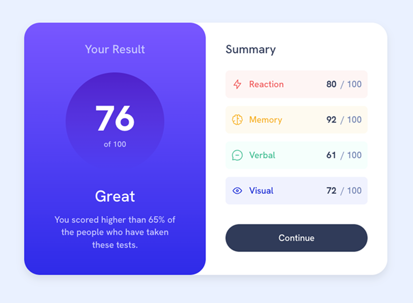
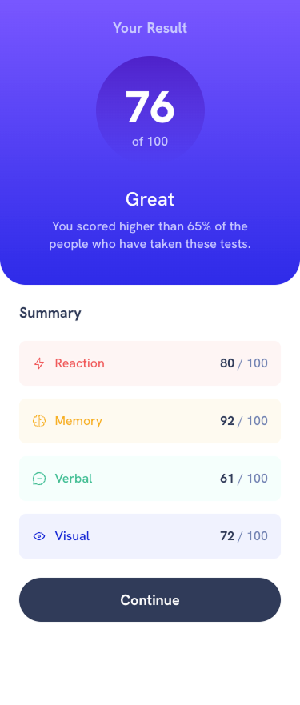

# Frontend Mentor - Results summary component solution

This is a solution to the [Results summary component challenge on Frontend Mentor](https://www.frontendmentor.io/challenges/results-summary-component-CE_K6s0maV). Frontend Mentor challenges help you improve your coding skills by building realistic projects.

## Overview

### The challenge

Users should be able to:

- View the optimal layout for the interface depending on their device's screen size
- See hover and focus states for all interactive elements on the page
- **Bonus**: Use the local JSON data to dynamically populate the content

### Screenshots

#### Desktop Layout

#### Mobile Layout

### Links

- Solution URL: [Github Repo](https://github.com/jcnnll/fem-results-summary-component)
- Live Site URL: [Live Site](https://jcnnll.github.io/fem-results-summary-component/)

## My process

### Technologies Used

- **React** – Component-based UI architecture
- **Vite** – Fast development server and modern build tooling
- **SCSS (Sass)** – Nested styles, variables, and design tokens
- **CSS Modules** – Scoped component styles to prevent global collisions
- **CSS Flexbox** – Layout and alignment
- **JSON** – Data-driven rendering of summary items

### Styling Approach

- Built the layout **desktop-first**, matching the design spec pixel-for-pixel
- Added a targeted mobile breakpoint to adapt the layout for smaller screens
- Used **SCSS variables** for colors, gradients, and typography based on the style guide
- Scoped all component styles using **CSS Modules**
- Implemented contextual styles for summary items based on their category
- Used `rem` units to keep spacing and typography scalable

### Accessibility & Semantics

- Used semantic HTML elements where appropriate
- Ensured:
  - Real `<button>` elements for actions
  - Clear and consistent heading hierarchy
  - Decorative icons hidden from screen readers
  - Text alternatives and readable color contrast
- Followed WCAG recommendations for accessible UI patterns

### Layout & Responsiveness

- Desktop layout uses a two-column flexbox design
- Mobile layout stacks sections vertically
- Responsive behavior targets:
  - **375px (mobile)**
  - **1440px (desktop)**
- Layout responsibilities are handled at the container level to keep components reusable

## Key Learnings

- Translating static design specs into responsive layouts
- Managing layout responsibility between components and containers
- Using SCSS variables and maps to keep styles consistent and maintainable
- Applying accessibility best practices in a component-based UI

## Author

- Website - [Justin Connell](https://github.com/jcnnll)
- Frontend Mentor - [@jcnnll](https://www.frontendmentor.io/profile/jcnnll)
